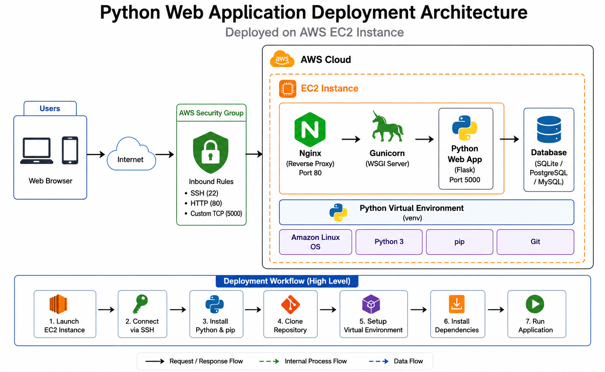
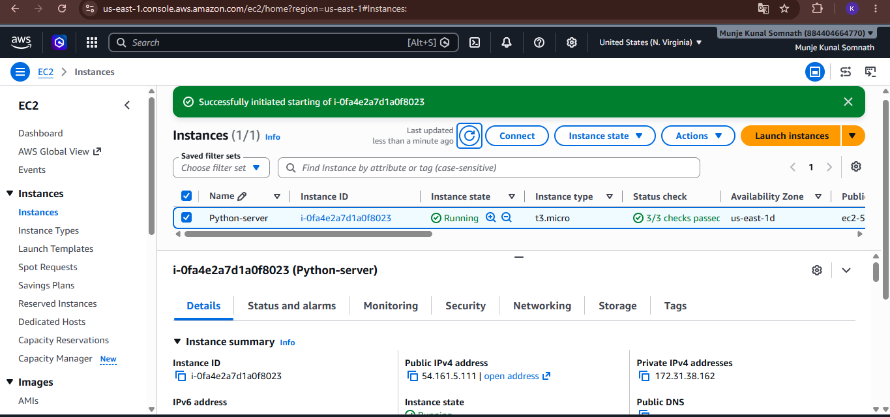
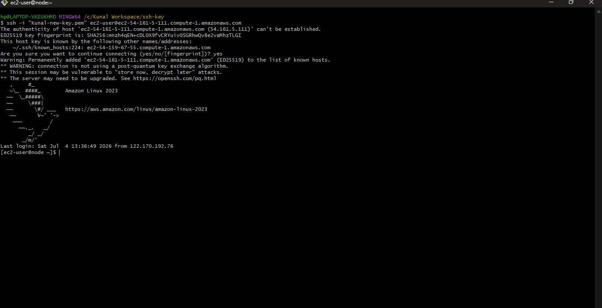
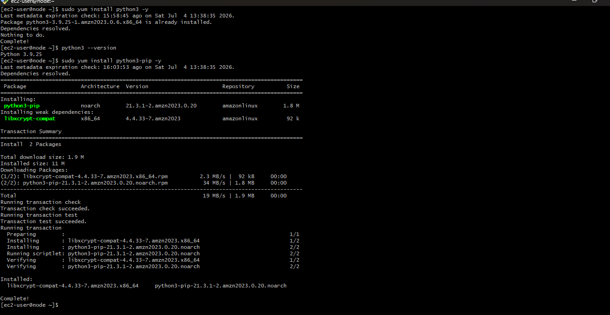
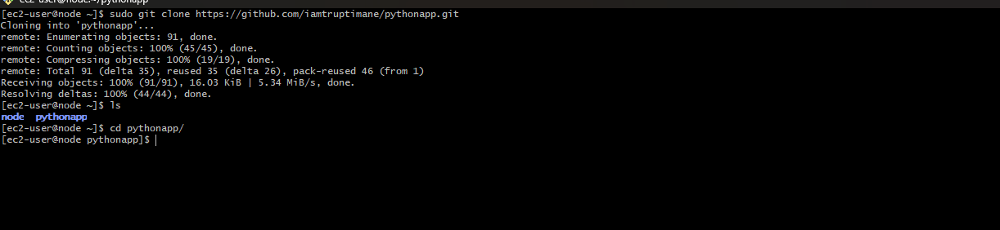
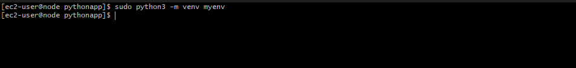
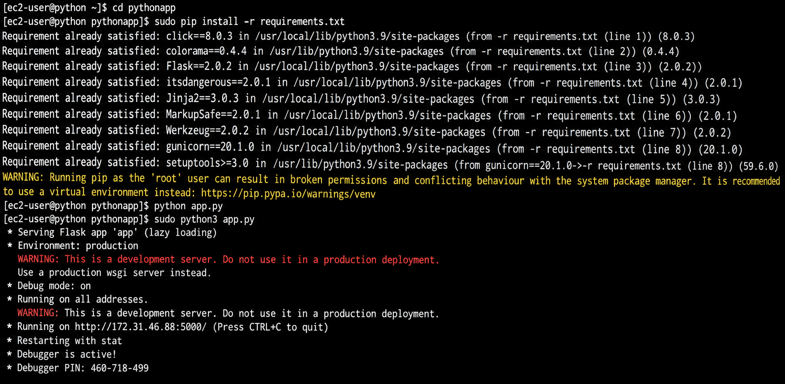
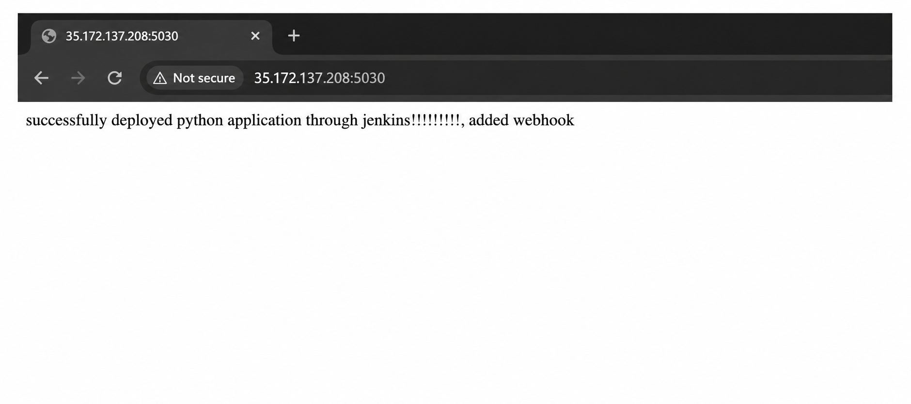

# Python Web Application Deployment on Ec2
### Introduction 
This project  demonstrates how to deploy a Python web application on a cloud server using Amazon Ec2. it covers the complete process from  lunching a virtual server to running the application successfully.

The main objective of this project was to learn and implement the complete deployment process of a Python web application on the AWS cloud.
### Architecture Diagram

### Technologies Used
- AWS Amazon Linux (EC2)
- Python 3
- pip
- Git
- Python Virtual Environment (venv)
- SSH
- Flask (Python Web Framework)
### Setup  & Deployment Steps
1. Launch Ec2 Instance

2. Connect using ssh 
- ssh-i your-kem.pem ec2-user@your-public-ip

3. Installation of Python & pip
- sudo yum update -y
- sudo yum install python3 -y
- sudo yum install python3-pip -y

4. Clone the Repository 
- git clone url
- cd pythonapp/

5. Create virtual Environment
- sudo python3 -m venv myenv

6. Install Dependencies
- sudo pip install -r requirements.txt
- python3 app.py

7. Access the Application
- Public ip:Port
- Port no: 5000

### Features
- AWS EC2 Cloud Deployment
- Complete setup from scatch
- Python Virtual Environment
- Git Integration
- Dependency Management with pip
- virtual environment usage
### Challenges faced
- SSH Connection Setup
- Virtual Environment Configuration
- Dependency Installation
- Security Group Configuration
### Summary
This project demonstrates the successful deployment of a Python Flask web application on AWS EC2. The application was deployed by configuring the server, creating a Python virtual environment, installing dependencies, and making it accessible through a web browser. Through this project, I gained hands-on experience in AWS EC2, Linux server management, SSH connectivity, Git, Python virtual environments, dependency management, and cloud-based application deployment.